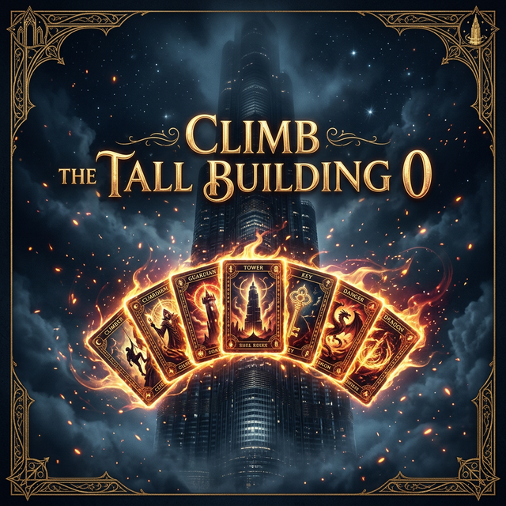

# CLIMB THE TALL BUILDING 0



**Climb The Tall Building 0** is a deck-building roguelike card game where you build a powerful deck, fight enemies, and climb the tall building. Inspired by the legendary *Slay the Spire*, rebuilt from the ground up with a premium dark fantasy aesthetic.

## 🚀 Features

- **Deck-Building Combat**: Draw, play, and strategize with 18+ unique cards.
- **Turn-Based Battles**: Play attack, skill, and power cards using energy each turn.
- **Status Effects**: Vulnerable, Weak, Strength, Thorns, and Metallicize mechanics.
- **Branching Map**: Pick your path through combat, elite, rest, event, and boss nodes.
- **13 Enemies**: From Jaw Worms and Cultists to elite Gremlin Nobs and bosses like The Guardian.
- **Card Upgrades**: Rest at campfires to heal or upgrade a card.
- **Post-Combat Rewards**: Choose from 3 new cards after each victory.
- **Premium Dark UI**: Cinzel serif title font, glowing cards, animated intents, energy orbs.

## 🎮 How to Play

| Action | Description |
| :--- | :--- |
| **Click Card** | Select a card to play (skill/power play immediately, attacks need a target) |
| **Click Enemy** | Target an enemy with a selected attack card |
| **End Turn** | Click END TURN to pass to the enemy's turn |
| **Map Node** | Click glowing nodes to advance on the map |
| **Rest Site** | Choose to Heal (30% HP) or Upgrade a card |

## 🛠️ Tech Stack

- **Frontend**: React 19 (TypeScript)
- **Build Tool**: Vite 8
- **State Management**: Zustand
- **Styling**: Tailwind CSS 4
- **Icons**: Lucide React

## 📦 Development

```bash
# Install dependencies
npm install

# Start dev server
npm run dev

# Production build
npm run build
```

## 📜 Credits

- **Developer**: Fezcode (Samil) — [fezcode.com](https://fezcode.com)
- **Inspired by**: Slay the Spire by MegaCrit

---

*Build v1.0.0 // The Tall Building Awaits*
